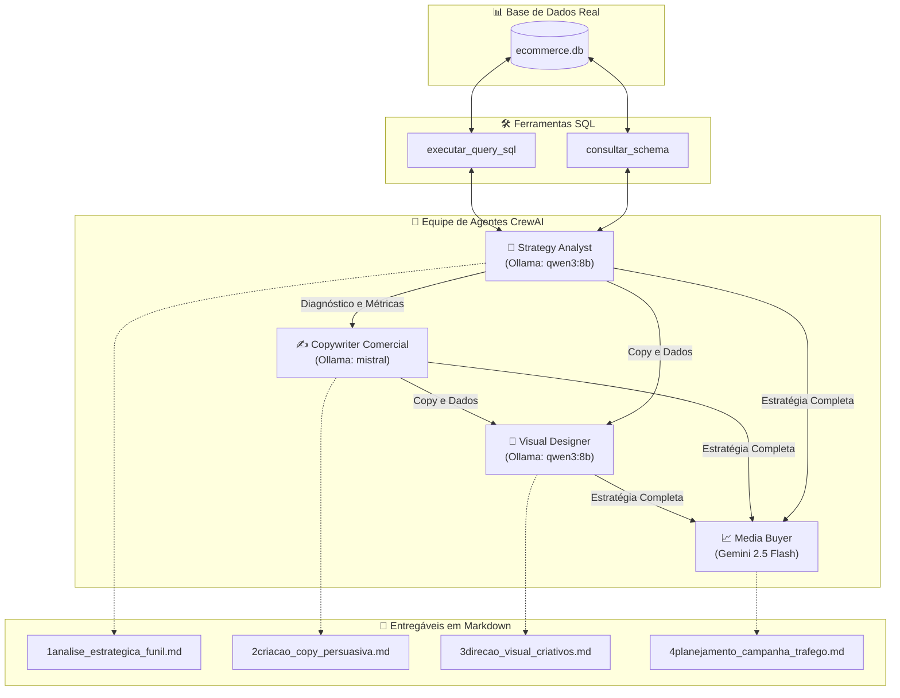

# 🚀 Sistema Autônomo de Marketing Digital com CrewAI

<div align="center">


<p align="center">
  <b>Uma equipe colaborativa de agentes autônomos de IA especializada em inteligência de dados, copywriting persuasivo, direção de arte e estratégia de mídia paga para e-commerce.</b>
</p>

</div>

---

## 📋 Índice

- [Sobre o Projeto](#-sobre-o-projeto)
- [Arquitetura e Fluxo de Trabalho](#-arquitetura-e-fluxo-de-trabalho)
- [Equipe de Agentes](#-equipe-de-agentes)
- [Tarefas do Fluxo (Tasks)](#-tarefas-do-fluxo-tasks)
- [Ferramentas SQL Customizadas](#-ferramentas-sql-customizadas)
- [Estrutura do Banco de Dados (`ecommerce.db`)](#-estrutura-do-banco-de-dados-ecommercedb)
- [Entregáveis Gerados](#-entregáveis-gerados)
- [Pré-requisitos](#-pré-requisitos)
- [Guia de Instalação e Configuração](#-guia-de-instalação-e-configuração)
- [Como Executar](#-como-executar)
- [Comandos CLI Avançados](#-comandos-cli-avançados)
- [Personalizando os Dados de Entrada](#-personalizando-os-dados-de-entrada)
- [Testes Automatizados](#-testes-automatizados)
- [Estrutura de Diretórios](#-estrutura-de-diretórios)
- [Notas sobre o Banco de Dados no GitHub](#-notas-sobre-o-banco-de-dados-no-github)
- [Licença](#-licença)

---

## 🎯 Sobre o Projeto

Este projeto implementa uma **equipe autônoma de marketing digital (Crew)** orquestrada com [CrewAI](https://github.com/crewAIInc/crewAI). Diferente de fluxos convencionais com prompts genéricos, esta crew baseia suas decisões em **dados reais extraídos diretamente de um banco de dados relacional SQLite (`ecommerce.db`)**.

O sistema opera de forma sequencial:
1. **Analisa métricas reais de tráfego, pedidos, estoque e campanhas passadas** para mapear o funil de conversão e diagnosticar gargalos.
2. **Elabora copys persuasivas de resposta direta** orientadas pelas dores e números levantados no diagnóstico.
3. **Cria um guia completo de direção de arte e layouts de criativos** (estáticos, vídeos e landing pages).
4. **Estrutura um plano de tráfego pago multicanal** com projeções de orçamento, segmentação de públicos e metas de ROAS e CPA baseadas no histórico real.

---

## 🔄 Arquitetura e Fluxo de Trabalho



---

## 👥 Equipe de Agentes

| Agente | Perfil / Cargo | Modelo LLM | Ferramentas | Missão Principal |
|---|---|---|---|---|
| **`strategy_analyst`** | Analista de Dados & Estrategista do Funil | `ollama/qwen3:8b` | `consultar_schema`, `executar_query_sql` | Executar queries SQL no SQLite, calcular taxas de conversão de topo/meio/fundo de funil e diagnosticar pontos de atrito. |
| **`copywriter`** | Redator de Resposta Direta & Copywriter | `ollama/mistral` | — | Produzir textos persuasivos, headlines, variações de anúncios e textos de landing page alinhados com o diagnóstico. |
| **`visual_designer`** | Diretor de Arte & UX/UI Designer | `ollama/qwen3:8b` | — | Definir paleta de cores, tipografia, wireframes e especificações visuais para criativos estáticos, carrosséis e páginas. |
| **`media_buyer`** | Especialista em Mídia Paga & Aquisição | `gemini/gemini-2.5-flash` | — | Planejar a estrutura de campanhas no Meta Ads, Google Ads e TikTok Ads, com orçamento, públicos e metas de ROAS/CPA. |

---

## 📌 Tarefas do Fluxo (Tasks)

1. **`analise_estrategica_funil`**:
   - Extrai métricas reais do banco do e-commerce (sessões, carrinhos abandonados, taxas de conversão, lead times de estoque e ROAS histórico).
   - Saída: `resultados_tasks/1analise_estrategica_funil.md`.

2. **`criacao_copy_persuasiva`**:
   - Desenvolve headlines principais e variações alternativas, copys para anúncios (curta e longa), roteiro de vídeo e estrutura modular da landing page.
   - Saída: `resultados_tasks/2criacao_copy_persuasiva.md`.

3. **`direcao_visual_criativos`**:
   - Constrói o manual de identidade visual da campanha (paleta de cores, hierarquia tipográfica, layout dos anúncios e wireframe da landing page).
   - Saída: `resultados_tasks/3direcao_visual_criativos.md`.

4. **`planejamento_campanha_trafego`**:
   - Estrutura campanhas por plataforma, distribuição de orçamento entre etapas do funil, testes A/B de públicos e matriz de KPIs esperados.
   - Saída: `resultados_tasks/4planejamento_campanha_trafego.md`.

---

## 🛠️ Ferramentas SQL Customizadas

As ferramentas foram construídas integrando o **LangChain SQLDatabase Toolkit** com o **CrewAI BaseTool**:

- **`consultar_schema` (`SQLSchemaTool`)**:
  - Recebe os nomes das tabelas separados por vírgula e retorna as colunas e tipos de dados exatos.
  - Utilizado pelo analista antes de montar qualquer consulta.

- **`executar_query_sql` (`SQLQueryTool`)**:
  - Executa instruções SQL `SELECT` contra o banco de dados.
  - Implementa proteção ativa impedindo operações destrutivas (bloqueia `INSERT`, `UPDATE`, `DELETE`, `DROP`).
  - Em caso de erro de sintaxe ou coluna inexistente, retorna a mensagem detalhada para que o agente ajuste a query iterativamente.

---

## 🗄️ Origem dos Dados e Estrutura do Banco (`ecommerce.db`)

O banco de dados relacional SQLite (`ecommerce.db`) centraliza todas as informações analíticas da operação de e-commerce e é utilizado pelos agentes para extrair métricas de funil, conversão e estoque. 

> [!NOTE]
> Para manter o repositório Git leve, o arquivo **`ecommerce.db` está no `.gitignore`** e deve ser gerado localmente a partir dos dados originais.

O projeto conta com uma esteira completa de engenharia de dados:

- 📁 **`database/`**: Contém os arquivos CSV brutos originais da operação de e-commerce.
- 📓 **[`database_sql.ipynb`](database_sql.ipynb)**: Notebook de **Definição de Esquema DDL** via **SQLAlchemy Core**. Estabelece formalmente tabelas, tipagens, chaves primárias e chaves estrangeiras.
- 📓 **[`eda.ipynb`](eda.ipynb)**: Notebook de **Análise Exploratória (EDA)** e **ETL**. Trata nulos, converte tipos, deduplica sessões, gera gráficos de comportamento e popula o banco `ecommerce.db` (além de exportar CSVs higienizados para `database_clean/`).

### 📋 Tabelas Modeladas no Banco de Dados:

| Tabela | Arquivo Fonte (`database/`) | Descrição |
|---|---|---|
| `customers` | `customers.csv` | Cadastro de clientes, métricas de LTV, AOV, canal de aquisição e intervalo até recompra. |
| `sku_catalog` | `sku_catalog.csv` | Catálogo de produtos, categorias, fornecedores, preço de tabela (MRP) e custo unitário. |
| `inventory_snapshots` | `inventory_snapshots.csv` | Posição diária de estoque, velocidade de vendas (7d, 30d, 60d) e sinalização de *dead stock*. |
| `orders` | `orders.csv` | Pedidos realizados, status de pagamento, faturamento bruto/líquido e canal de conversão. |
| `order_line_items` | `order_line_items.csv` | Itens individuais de cada pedido, tamanhos, descontos aplicados e motivos de devolução. |
| `website_sessions` | `website_sessions.csv` | Mais de 470.000 sessões granulares de tráfego, fontes de aquisição, dispositivo e jornada. |
| `website_daily` | `website_daily.csv` | Agregações diárias de tráfego, visualizações de produto, abandono e taxa de conversão. |
| `meta_ads_campaigns` | `meta_ads_campaigns.csv` | Histórico real de campanhas de anúncios, impressões, cliques, CTR, CAC e ROAS. |
| `purchase_orders` | `purchase_orders.csv` | Ordens de compra de reposição de estoque com fornecedores e monitoramento de *lead time*. |

---

## 📦 Entregáveis Gerados

Após a execução da crew, os resultados são automaticamente persistidos no diretório `resultados_tasks/`:

- 📄 [`1analise_estrategica_funil.md`](resultados_tasks/1analise_estrategica_funil.md): Diagnóstico com números reais de tráfego, conversão e inventário.
- 📄 [`2criacao_copy_persuasiva.md`](resultados_tasks/2criacao_copy_persuasiva.md): Copys, hooks, roteiros de retenção e estrutura de página.
- 📄 [`3direcao_visual_criativos.md`](resultados_tasks/3direcao_visual_criativos.md): Guia de arte, cores, wireframes e composição de criativos.
- 📄 [`4planejamento_campanha_trafego.md`](resultados_tasks/4planejamento_campanha_trafego.md): Plano de mídia paga, segmentações, lances e cronograma de testes.

> Os prompts dos agentes solicitam respostas em português-BR. Os arquivos exibidos em
> `resultados_tasks/` são exemplos gerados durante o desenvolvimento e podem conter
> trechos em inglês ou valores em rúpias indianas (`₹`), pois os dados de exemplo
> representam uma operação de e-commerce na Índia. Eles não são uma garantia de
> idioma, moeda ou contexto para novas execuções.

---

## ⚙️ Pré-requisitos

- **Python**: versão `3.10` a `3.13`.
- **[uv](https://docs.astral.sh/uv/)** (recomendado) ou gerenciador de pacotes compatível.
- **[Ollama](https://ollama.com/)** instalado e rodando localmente na porta padrão (`http://localhost:11434`).
- **Chave de API do Google Gemini** (para o agente `media_buyer`).

---

## 🚀 Guia de Instalação e Configuração

### 1. Clonar o repositório

Clone o repositório criado no GitHub e entre na pasta do projeto.

### 2. Instalar as dependências com `uv`

```bash
uv sync
```

### 3. Configurar as variáveis de ambiente

Copie o arquivo de exemplo e preencha com suas configurações:

```bash
cp .env.example .env
```

Edite o arquivo `.env`:

```env
# Chave do Google AI Studio para o agente de mídia
GEMINI_API_KEY=sua_chave_gemini_aqui

# Telemetria do CrewAI (opcional)
CREWAI_TRACING_ENABLED=false
```

Os modelos e a URL local do Ollama são definidos diretamente em
[`src/marketing_digital/crew.py`](src/marketing_digital/crew.py) e nas ferramentas
SQL. As variáveis `MODEL` e `API_BASE` não configuram os agentes desta versão.

### 4. Criar e Popular o Banco de Dados (`ecommerce.db`)

Como o banco `ecommerce.db` possui mais de 50 MB, ele é **gerado localmente** a partir dos arquivos CSV em `database/`. Você pode criá-lo de duas formas:

#### Opção A: Pelo Terminal (Recomendado)

Utilize o `uv` para executar os notebooks diretamente pela linha de comando sem necessidade de abrir uma IDE:

```bash
# 1. Cria a estrutura relacional das tabelas no SQLite (DDL)
uv run --with jupyter jupyter execute database_sql.ipynb

# 2. Executa a limpeza dos dados (ETL), análise exploratória e popula o ecommerce.db
uv run --with jupyter jupyter execute eda.ipynb
```

#### Opção B: Pela Interface Interativa (VS Code / Cursor / JupyterLab)

1. Abra o arquivo [`database_sql.ipynb`](database_sql.ipynb) e clique em **Run All** (Executar Tudo) para criar as tabelas.
2. Em seguida, abra o arquivo [`eda.ipynb`](eda.ipynb) e clique em **Run All** (Executar Tudo) para limpar os dados brutos e carregá-los no SQLite.

*(Ao final da execução, o arquivo `ecommerce.db` estará criado na raiz do projeto,
com os registros distribuídos entre as 9 tabelas do dataset.)*

### 5. Baixar os modelos no Ollama

Certifique-se de que o serviço do Ollama está em execução e faça o download dos modelos utilizados:

```bash
ollama pull qwen3:8b
ollama pull mistral
```

*(Opcional: se desejar utilizar um modelo local alternativo para o media buyer, você também pode baixar `ollama pull qwen2.5:7b`).*

---

## 💻 Como Executar

### Execução padrão da Crew

Você pode iniciar a execução da equipe através de qualquer um dos comandos abaixo:

```bash
# Via CrewAI CLI
crewai run

# Ou via script configurado no pyproject.toml
uv run marketing_digital

# Ou executando o módulo Python diretamente
uv run python -m marketing_digital.main run
```

---

## 🧰 Comandos CLI Avançados

O módulo `main.py` disponibiliza comandos de ciclo de vida do CrewAI:

```bash
# 1. Executar a Crew normalmente
uv run python -m marketing_digital.main run

# 2. Treinar os agentes por N iterações para calibrar comportamento
uv run python -m marketing_digital.main train 5 training_data.json

# 3. Reexecutar a partir de uma tarefa específica usando seu Task ID
uv run python -m marketing_digital.main replay <TASK_ID>

# 4. Avaliar a qualidade dos outputs da equipe com um modelo avaliador
uv run python -m marketing_digital.main test 2 gpt-4o-mini
```

---

## ⚙️ Personalizando os Dados de Entrada

Os parâmetros da campanha podem ser personalizados diretamente na função `get_inputs()` em [`src/marketing_digital/main.py`](src/marketing_digital/main.py):

```python
def get_inputs() -> dict:
    return {
        "produto_ou_servico": "KnitCraft Studio",
        "nicho_ou_mercado": "Vestuário",
        "objetivo_campanha": "Gerar leads qualificados para o funil de vendas",
        "periodo_analise": "últimos 30 dias",
    }
```

Essas variáveis preenchem automaticamente os placeholders `{produto_ou_servico}`, `{nicho_ou_mercado}`, `{objetivo_campanha}` e `{periodo_analise}` configurados em `agents.yaml` e `tasks.yaml`.

---

## 🧪 Testes Automatizados

O projeto inclui testes de integridade estrutural para validar se todos os agentes, tarefas e configurações são inicializados corretamente:

```bash
uv run python -m unittest discover tests
```

---

## 📂 Estrutura de Diretórios

```plaintext
marketing_digital/
├── .env.example                   # Modelo das variáveis de ambiente
├── .gitignore                     # Regras de exclusão para o Git
├── AGENTS.md                      # Manual de referência de padrões CrewAI
├── database/                      # Arquivos CSV originais da operação de e-commerce
│   ├── customers.csv
│   ├── inventory_snapshots.csv
│   ├── meta_ads_campaigns.csv
│   ├── order_line_items.csv
│   ├── orders.csv
│   ├── purchase_orders.csv
│   ├── sku_catalog.csv
│   ├── website_daily.csv
│   └── website_sessions.csv
├── database_sql.ipynb             # Notebook DDL: definição formal do esquema relacional
├── eda.ipynb                      # Notebook ETL/EDA: limpeza, exploração e carga no SQLite
├── ecommerce.db                   # Banco SQLite gerado localmente via eda.ipynb (ignorado no Git)
├── pyproject.toml                 # Configurações do projeto e dependências UV
├── README.md                      # Documentação completa do projeto
├── resultados_tasks/              # Saídas em Markdown geradas pela Crew
│   ├── 1analise_estrategica_funil.md
│   ├── 2criacao_copy_persuasiva.md
│   ├── 3direcao_visual_criativos.md
│   └── 4planejamento_campanha_trafego.md
├── src/
│   └── marketing_digital/
│       ├── __init__.py
│       ├── crew.py                # Definição dos agentes, tasks e da MarketingCrew
│       ├── main.py                # Ponto de entrada CLI (run, train, replay, test)
│       ├── config/
│       │   ├── agents.yaml        # Papéis, objetivos e backstories dos agentes
│       │   └── tasks.yaml         # Descrições e saídas esperadas das tarefas
│       └── tools/
│           ├── __init__.py
│           └── custom_tool.py     # Tools de consulta e schema SQL via LangChain
└── tests/
    └── test_crew.py               # Testes de integridade estrutural
```

---

## 💾 Notas sobre o Banco de Dados no GitHub

- O arquivo `ecommerce.db` possui mais de **50 MB** e está devidamente configurado no [`.gitignore`](.gitignore), **não sendo enviado para o GitHub**.
- Essa prática mantém o repositório leve, rápido de clonar e evita alertas de tamanho de arquivo da plataforma.
- Os arquivos CSV do diretório `database/` são as entradas do pipeline de geração local. Qualquer pessoa que clonar o projeto pode recriar o banco seguindo o [passo 4 do guia de instalação](#4-criar-e-popular-o-banco-de-dados-ecommercedb), desde que tenha acesso aos dados e às dependências dos notebooks.

---

## 📄 Licença

Este projeto está sob a licença [MIT](LICENSE). Sinta-se livre para usar, modificar e distribuir conforme necessário.
